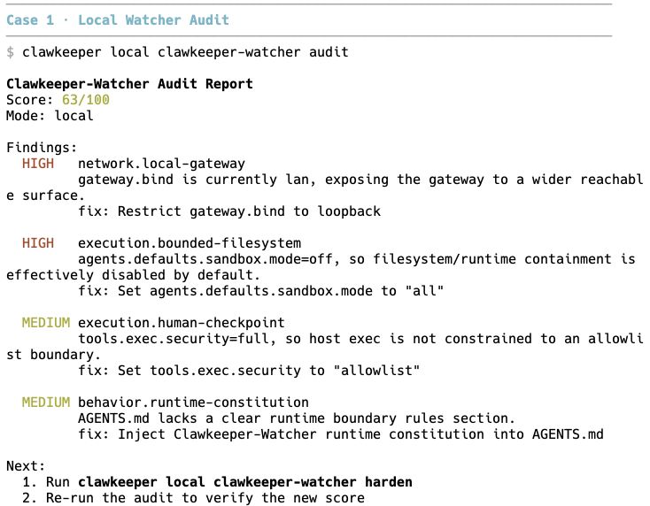
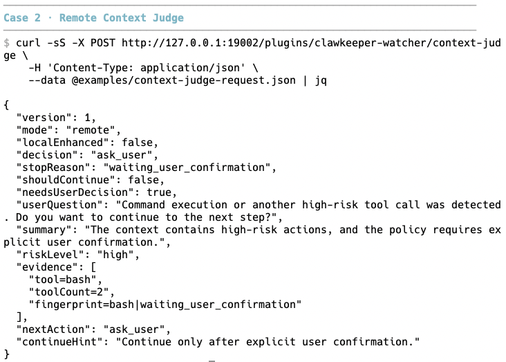
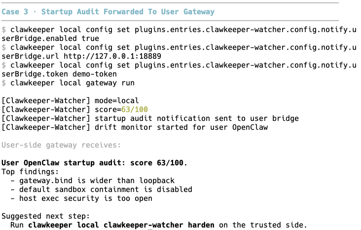
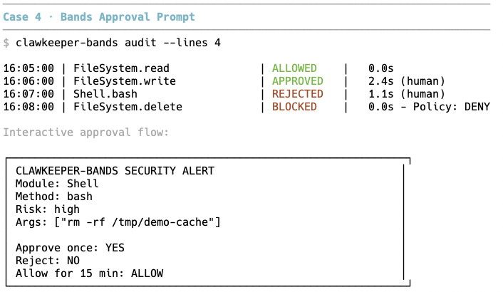
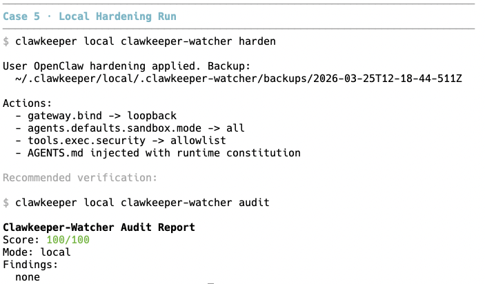
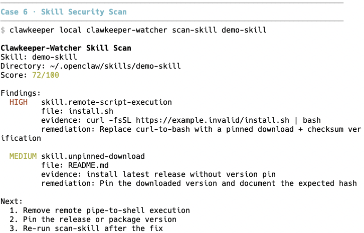

# Clawkeeper(Watcher): Watcher-Based Runtime Governance for OpenClaw

<p align="left">
  <a href="https://github.com/openclaw/openclaw">
    
  </a>
  <a href="https://opensource.org/licenses/MIT">
    
  </a>
</p>

**A watcher-first runtime governance layer for OpenClaw.**

Clawkeeper is centered on `clawkeeper-watcher`, a governance watcher for OpenClaw that adds context judgment, audit, hardening, drift monitoring, rollback, and remote risk intelligence around the runtime. The repository also includes the `clawkeeper` launcher for mode-scoped execution and `clawkeeper-bands`, a user-side approval and bridge plugin for notifications, confirmations, and remote judge relay.

[Repository](https://github.com/xunyoyo/clawkeeper) · [Watcher Plugin](plugins/clawkeeper-watcher/README.md) · [Bands Plugin](plugins/clawkeeper-bands/README.md) · [Clawkeeper Skill](skills/clawkeeper/SKILL.md) · [License](LICENSE)

This repo also ships a matching OpenClaw skill at `skills/clawkeeper/SKILL.md` for setup, configuration, verification, and debugging workflows.

# 💡 Features

Clawkeeper is designed as a watcher-centered governance layer around OpenClaw rather than a single-point filter. It keeps runtime judgment, local remediation, and user-side approvals explicit so the system stays auditable and easier to reason about.

### 👁️ Watcher Core

The watcher is the center of the system:

- **Context Judgment**: Review structured agent context before risky execution continues
- **Shared HTTP Contract**: Expose `POST /plugins/clawkeeper-watcher/context-judge`
- **Event Observation**: Capture tool calls, messages, and LLM activity for later analysis
- **Governance Output**: Return `continue`, `ask_user`, or `stop` with evidence and next-step hints

### 🔐 Local Protection

On the trusted side, the watcher can actively protect local state:

- **Startup Audit**: Inspect local OpenClaw state during startup
- **Safe Hardening**: Apply only explicitly safe remediation paths
- **Drift Monitoring**: Detect policy and config changes and re-audit on change
- **Skill Guard**: Periodically scan user-installed skills under `~/.openclaw/skills`
- **Backup and Rollback**: Preserve rollback points before local fixes are applied

### 👁️ Remote Intelligence

On the remote side, the watcher can accumulate long-horizon security signals:

- **Decision Memory**: Persist elevated-risk and non-continue outcomes
- **Risk Fingerprints**: Match recurring high-risk patterns across sessions
- **Agent Profiling**: Compare current behavior against historical baselines
- **Intent Drift Detection**: Flag tool chains that diverge from the user's apparent request

### 🎯 Mode-Specific Deployment

Clawkeeper packages the watcher into two operating modes with explicit trust boundaries:

- **Remote Watcher**: Read-only risk judgment, confirmation gating, and historical intelligence
- **Local Watcher**: Trusted audit, hardening, rollback, and drift monitoring
- **Operational Isolation**: Each mode runs in its own prepared state, config, and workspace tree

### 🔗 User-Side Bridge

Keep the user-facing gateway separate from the local remediation side:

- **Startup Audit Forwarding**: Send summary notifications back to a user gateway
- **Approval Flow Integration**: Let `clawkeeper-bands` hold pending confirmations on the receiving side
- **Remote Judge Relay**: Forward finished agent context to a remote watcher and surface `continue`, `ask_user`, or `stop`

### 📋 Auditing and Visibility

Make runtime behavior queryable instead of implicit:

- **Event Logging**: Record tool calls, message traffic, and LLM input/output events
- **Risk Scanning**: Analyze event logs for suspicious patterns
- **Structured Output**: Produce shared audit and scan report fields for human review and scripting
- **Mode Status Inspection**: Check initialization status and watcher readiness from the launcher

## Core Pieces

Clawkeeper is easiest to understand as four separate surfaces:

- `plugins/clawkeeper-watcher/`
  - the core watcher-first governance plugin
  - owns `context-judge`, event logging, audit, hardening, rollback, and remote intelligence
- `plugins/clawkeeper-bands/`
  - the user-side approval and bridge plugin
  - owns risky tool approval, startup-audit receiving, and remote judge relay
- `clawkeeper/`
  - the launcher for `remote` and `local` mode execution
- `skills/clawkeeper/SKILL.md`
  - the bundled OpenClaw skill for setup, verification, and troubleshooting

If you only want the core governance engine, start with `clawkeeper-watcher`. If you want a user-facing approval layer or watcher notifications on another gateway, add `clawkeeper-bands`.

# 🚀 Quick Start

## Install from source

### 1. Install repository dependencies

```bash
pnpm install
```

### 2. Build and link the `clawkeeper` launcher

```bash
cd clawkeeper
npm install
npm run build
npm link
cd ..
```

### 3. Initialize the two operating modes

```bash
clawkeeper init remote
clawkeeper init local
clawkeeper local config set gateway.mode local
```

### 4. Launch through Clawkeeper

```bash
# Remote mode
clawkeeper remote gateway run

# Local mode
clawkeeper local gateway run
```

By default, Clawkeeper stores mode state under:

```text
~/.clawkeeper/
├── remote/
└── local/
```

## Included skill

Clawkeeper includes a bundled workspace skill:

```text
skills/clawkeeper/SKILL.md
```

Use it when you want the agent to handle Clawkeeper setup, mode initialization, watcher verification, bridge wiring, or troubleshooting through a consistent workflow instead of ad hoc guessing.

---

# 🎮 Feature Cases

The README currently highlights 6 core product cases:

## 1. Audit local runtime state

Run:

```bash
clawkeeper local clawkeeper-watcher audit
```

Use this case when you want a scored report of current local risk posture before making changes.



## 2. Judge forwarded context on the remote side

Send structured context to:

```text
POST /plugins/clawkeeper-watcher/context-judge
```

Use this case when you want the remote watcher to return `continue`, `ask_user`, or `stop` without modifying local state.



## 3. Forward startup audit summaries to a user gateway

Install `clawkeeper-bands` on the receiving gateway and enable the local watcher bridge:

```bash
openclaw plugins install --link /path/to/clawkeeper/plugins/clawkeeper-bands
clawkeeper local config set plugins.entries.clawkeeper-watcher.config.notify.userBridge.enabled true
clawkeeper local config set plugins.entries.clawkeeper-watcher.config.notify.userBridge.url http://127.0.0.1:18889
clawkeeper local config set plugins.entries.clawkeeper-watcher.config.notify.userBridge.token <gateway-token>
```

Use this case when you want local-side watcher findings to appear on the user-facing gateway.



## 4. Pause risky tool calls for human approval

On the user-facing gateway, `clawkeeper-bands` can pause risky tool calls and wait for a human decision while keeping an audit trail of approvals, rejections, and policy blocks.

Use this case when you want explicit operator confirmation before shell, write, delete, or network side effects continue.



## 5. Apply safe hardening

Run:

```bash
clawkeeper local clawkeeper-watcher harden
```

Use this case when you want the watcher to apply explicit safe remediations and create a rollback point first.



## 6. Scan a skill for risky patterns

Run:

```bash
clawkeeper local clawkeeper-watcher scan-skill <name-or-path>
```

Use this case when you want to inspect a local or installed skill for dangerous install or runtime patterns.



# 🔄 Watcher Modes

`clawkeeper-watcher` runs in two modes with different responsibilities:

| Capability                           | `remote` | `local` |
| ------------------------------------ | -------- | ------- |
| Context judge HTTP endpoint          | yes      | yes     |
| Passive event logging                | yes      | yes     |
| Read-only status and log inspection  | yes      | yes     |
| Multi-turn session state judgment    | yes      | yes     |
| Decision memory persistence          | yes      | no      |
| Risk fingerprints                    | yes      | no      |
| Agent behavior profiling             | yes      | no      |
| Intent drift detection               | yes      | yes     |
| Startup audit against user state     | no       | yes     |
| Audit / hardening / drift monitoring | no       | yes     |
| Startup audit notification bridge    | no       | yes     |
| Skill scanning and local remediation | no       | yes     |
| Backup and rollback for local fixes  | no       | yes     |

---

# 🌐 Context Judge Contract

Both modes expose the same HTTP route:

```text
POST /plugins/clawkeeper-watcher/context-judge
```

The handler returns one of three decisions:

- `continue`
- `ask_user`
- `stop`

Typical response shape:

```json
{
  "version": 1,
  "mode": "local",
  "localEnhanced": true,
  "decision": "ask_user",
  "stopReason": "waiting_user_confirmation",
  "shouldContinue": false,
  "needsUserDecision": true,
  "userQuestion": "Command execution or another high-risk tool call was detected. Do you want to continue to the next step?",
  "summary": "The context contains high-risk actions, and the policy requires explicit user confirmation.",
  "riskLevel": "high",
  "evidence": ["tool=bash", "toolCount=2"],
  "nextAction": "ask_user",
  "continueHint": "Continue only after explicit user confirmation."
}
```

# 🛠️ Command Reference

### Launcher commands

```bash
clawkeeper status
clawkeeper init remote
clawkeeper init local
clawkeeper remote gateway run
clawkeeper local gateway run
```

### Watcher commands available in both modes

```bash
clawkeeper remote clawkeeper-watcher status
clawkeeper local clawkeeper-watcher status
clawkeeper remote clawkeeper-watcher logs
clawkeeper local clawkeeper-watcher logs --scan
clawkeeper local clawkeeper-watcher log-path
clawkeeper remote clawkeeper-watcher fingerprints
clawkeeper remote clawkeeper-watcher profiles
clawkeeper local clawkeeper-watcher scan-skill <name-or-path>
```

### Local-only governance commands

```bash
clawkeeper local clawkeeper-watcher audit
clawkeeper local clawkeeper-watcher audit --json
clawkeeper local clawkeeper-watcher audit --fix
clawkeeper local clawkeeper-watcher harden
clawkeeper local clawkeeper-watcher monitor
clawkeeper local clawkeeper-watcher rollback [backup]
```

### Plugin docs

```text
plugins/clawkeeper-watcher/README.md
plugins/clawkeeper-bands/README.md
skills/clawkeeper/SKILL.md
```

---

# 📂 Architecture

Clawkeeper is organized around three main layers:

1. **Watcher Plugin** (`plugins/clawkeeper-watcher/`)
   - Core watcher-first governance layer
   - Owns `POST /plugins/clawkeeper-watcher/context-judge`
   - Handles event logging, audit, hardening, rollback, monitoring, skill scanning, and remote intelligence

2. **Launcher** (`clawkeeper/`)
   - Mode initialization and isolated directory preparation
   - `remote` and `local` execution entry points
   - Shared CLI surface through `clawkeeper ...`

3. **Bands Plugin** (`plugins/clawkeeper-bands/`)
   - User-facing approval and bridge layer
   - Owns `POST /plugins/clawkeeper-bands/clawkeeper-startup-audit`
   - Handles pending confirmations, startup-audit delivery, and remote judge relay

### File Structure

```text
.
├── clawkeeper/                 # Launcher package and mode bootstrap
├── plugins/clawkeeper-watcher/ # Watcher plugin and governance logic
├── plugins/clawkeeper-bands/   # User-side bridge and approval plugin
├── src/                        # Underlying OpenClaw runtime codebase
├── VISION.md                   # Direction and positioning
└── README.md                   # Project overview
```

---

# 📕 Reference

- Watcher plugin: [plugins/clawkeeper-watcher/README.md](plugins/clawkeeper-watcher/README.md)
- Bands plugin: [plugins/clawkeeper-bands/README.md](plugins/clawkeeper-bands/README.md)
- OpenClaw skill: [skills/clawkeeper/SKILL.md](skills/clawkeeper/SKILL.md)
- Vision: [VISION.md](VISION.md)
